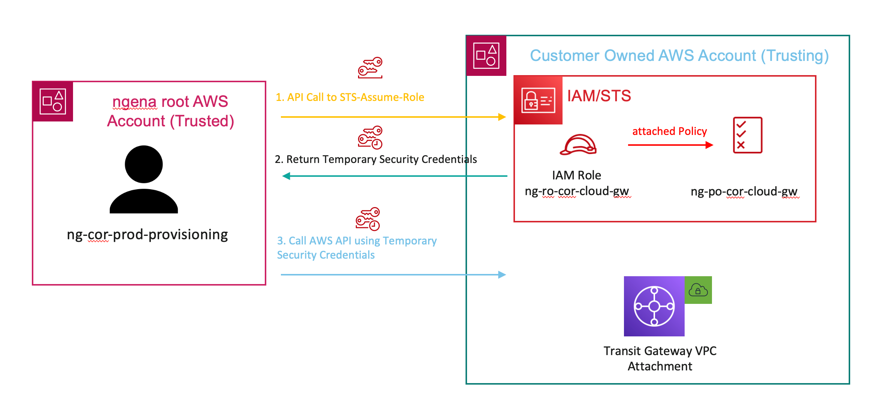

# ng-cor-iam-customer

ngena AWS Cloud Gateway is deployed as Infrastructure as a Service (IaaS) in AWS Cloud environment. Individual components necessary to support solution are deployed and managed by ngena orchestration via API. In order to onboard and manage ngena AWS Cloud Gateway during whole life cycle, API access into the AWS is required to set up. AWS API Gateway supports multiple mechanisms for controlling and managing access to API. ngena AWS Cloud Gateway supports IAM Role-based access for authentication and control access to the resources. IAM Role-based access is gaining more and more popularity and starting to evolve as a in fact standard for API access into AWS.
IAM Role-based access is then used to deploy all ngena AWS Cloud Gateway resources as well as all resources necessary to connect Customer VPCs (Host VPCs) to ngena AWS Cloud Gateway.
Permissions to AWS resources are defined by IAM Policy. A policy is an object in AWS that, when associated with an identity or resource, defines their permissions. AWS evaluates these policies when an IAM Principal (user or role) makes a request. Permissions in the policies determine whether the request is allowed or denied.
IAM Policies in ngena design are defined following the Principle of Least Privilege (PoLP), meaning any user, program, or process should have only the bare minimum privileges necessary to perform its function. Least privilege is also referred to as role-based access or need-to-know access and falls under AWS Identity and Access Management policies.

### Inputs

Name | Description | Type | Required|Default
---- | ----------- | ---- |-------  |-------
`external_id` |Unique identifier used by ngena to assume a role in customer account (used in IAM Role Policy template).| list(string)|Yes| `N/A`
`ngena_api_user_arn` |IAM user Principal ARN    whhich can assume a role in customer account (used in IAM Role Policy template).|list(string)|Yes| `N/A`
`policy`|The policy document for IAM Policy. This is a JSON formatted string.|object|No| `null`
`policy_path`|Path in which to create the policy.|string|No|`"/"`
`assume_role_policy`|Policy that grants an entity permission to assume the role. This is a JSON formatted string.|object|No|`null`
`max_session_duration`|Maximum session duration (in seconds) that you want to set for the specified role.|string|No|`"3600"`
`force_detach_policies`|Whether to force detaching any policies the role has before destroying it.|boolean|No|`false`
`role_permissions_boundary_arn`|Permissions boundary ARN to use for IAM role.|string|No|`""`
`role_path`|Path to the role. See IAM Identifiers for more information.|string|No|`"/system/"`
`policy_name`|(Forces new resource) The name of the policy. If omitted, Terraform will assign a random, unique name.|string|No|`"ng-cor-iam-policy"`
`policy_description`|(Forces new resource) Description of the IAM policy.|string|No|`"IAM Policy for creating Attachments to ngena AWS Cloud Gateway"`
`role_name`|The name of an IAM role name.|string|No|`"ng-cor-iam-role"`
`role_description`|(Forces new resource) Description of the IAM Role.|string|No|`"IAM Role for creating Attachments to ngena AWS Cloud Gateway"`
`tags`|Key-value map of resource tags.|map(any)|No|`{}`
`policy_tags`|Key-value map of resource tags. Can be used if dedicated tags for policy should be configured.|map(any)|No|`{}`
`role_tags`|Key-value map of resource tags.Can be used if dedicated tags for the Role should be configured.|map(any)|No|`{}`

### Outputs

Name       | Description
----       | -----------
`document_policy_cor_policy_json`|Default Policy document for IAM Policy to support ngena CoR.
`document_policy_cor_role_json`|Default Policy document for Assume role Policy Policy to support ngena CoR.
`iam-policy-arn`|ARN of IAM Policy for ngena AWS Cloud Gateway provisioning.
`iam-role-arn`|ARN of IAM Role for ngena AWS Cloud Gateway provisioning.

### Requirements, Providers

Name       | Version
-----      |--------
terraform  | ">=1.3"
aws        | "~> 4.19.0
